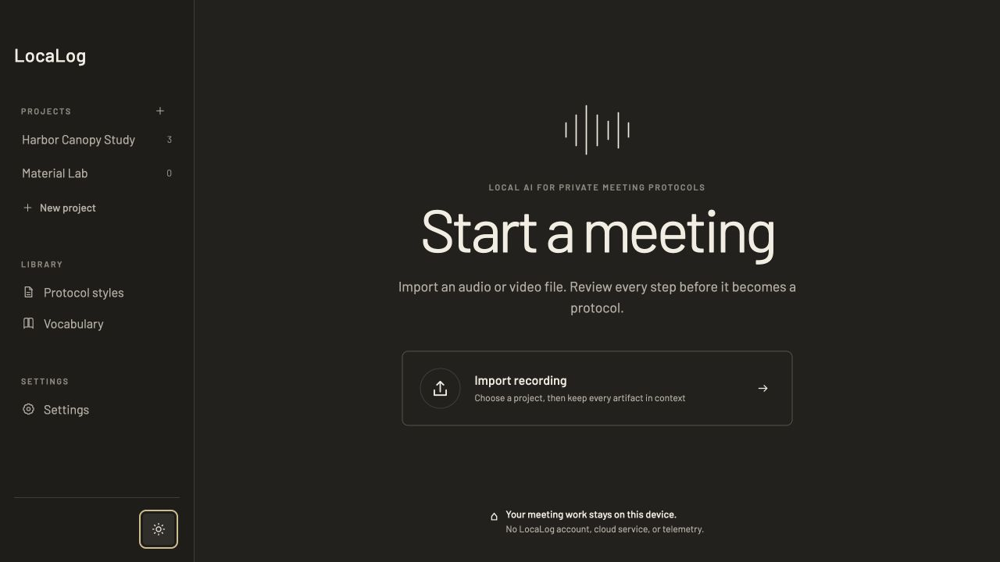

# LocaLog

### Local AI that turns meeting recordings into clear, reviewable protocols.

LocaLog is a local-first desktop application for people who need a useful written record after a meeting, but cannot send the conversation to a cloud AI service.

You import an audio or video recording, review the local transcript, and ask a local language model to prepare a protocol draft. The draft remains editable and provisional until a person has checked it. Projects and meetings keep the recording, transcript, protocol, and export together so the work does not disappear into a folder of unrelated files.

The protocol is the point of the product. Transcription is the reviewable source that makes a reliable protocol possible.

<p>
  
  
</p>

_The current shell uses synthetic project data. These screenshots show the visual direction in light and dark mode, not a finished release._

## Why LocaLog exists

Meeting recordings can contain personal information, internal decisions, client details, and material that is not allowed to leave an organisation's controlled environment. LocaLog is designed around that reality:

- meeting content stays on the device through the core workflow;
- no LocaLog account, cloud workspace, telemetry, or hosted AI service is required;
- generated text is visible, editable, and never silently treated as the final record;
- projects and meetings provide context for every recording and document;
- the interface is meant to feel like a calm professional writing tool, not a chatbot or model dashboard.

The project is open source under [GPL-3.0-or-later](LICENSE). macOS is the first development and validation platform. Windows and Linux remain intended platforms, with operating-system-specific work kept at the edges of the application.

## The workflow

```text
Project → Meeting → Import → Transcribe → Review → Generate → Edit → Export
```

The first useful workflow begins with an imported recording. Built-in microphone and system-audio recording are later possibilities, not part of the first complete path.

## Current state

LocaLog is an early working prototype, not a production application.

The repository currently contains:

- a Tauri desktop shell with Svelte and TypeScript on the frontend and Rust at the core;
- a warm light/dark visual system using locally bundled Barlow typography;
- project and meeting storage in SQLite with versioned transcript and protocol artifacts;
- durable import, transcription, and generation jobs with cancellation, retry, and restart recovery;
- local media probing and normalisation through supervised FFmpeg processes;
- a whisper.cpp boundary for local transcription, with consent-gated verified model downloads;
- an Ollama protocol provider for development and early technical previews;
- transcript review, Markdown editing, autosave, revision history, and Markdown/plain-text export;
- synthetic fixtures, evaluation harnesses, and isolated architecture spikes.

The native path still requires a locally supplied whisper.cpp executable and a user-managed Ollama server. Runtime bundling, the final public generation runtime, M1/8 GB performance validation, Windows/Linux builds, accessibility auditing, and backup/restore remain unfinished.

The most important unfinished work is protocol quality: proving that the generated document is complete, factually supported, and useful to a professional after light editing.

## Documentation

Start with the [documentation guide](docs/README.md). It explains which document to read for a particular question and distinguishes product goals, accepted decisions, current implementation status, and experimental evidence.

- [Product](docs/PRODUCT.md) — what LocaLog is for, who it serves, and what belongs in the first version
- [Experience and UX](docs/UX.md) — how the application should behave and feel
- [Visual direction](docs/VISUAL_DIRECTION.md) — typography, colour, spacing, and visual character
- [MVP](docs/MVP.md) — the first complete workflow and its boundaries
- [Architecture](docs/ARCHITECTURE.md) — how the application stores data and runs local work
- [Decisions](docs/DECISIONS.md) — accepted choices, open questions, and the evidence behind them
- [Current plan](docs/PLAN.md) — what is true now and what should happen next
- [Roadmap](docs/ROADMAP.md) — later possibilities, not promises for the current release

The `spikes/` folders contain isolated studies. They are evidence and test oracles, not production modules. The local-only `eval/` folder may contain real evaluation material and must never be committed or shared.

## Running the current build

The browser shell is useful for visual and workflow development. It uses synthetic data. The native shell exercises the real storage and process boundaries when the required local runtimes are available.

Prerequisites:

- Node.js 22.12 or newer
- npm
- Rust 1.97.1 through rustup

```sh
npm install
npm run dev
```

To run the Tauri shell:

```sh
npm run tauri dev
```

The complete checks are documented in [CONTRIBUTING.md](CONTRIBUTING.md).

## Contributing

The project is public while its foundations are still being proven. Before changing behaviour, read the product and architecture documents and check the current plan. Keep changes small, explain important trade-offs, and do not add real meeting material, credentials, model files, or runtime binaries to the repository.

## Licence

LocaLog is free software licensed under the [GNU General Public License v3.0 or later](LICENSE). You may use, study, modify, and redistribute it, including commercially, under the licence terms. Third-party dependencies, fonts, runtimes, models, and other assets retain their own licences.

Copyright © 2026 Pascal Nünninghoff.
