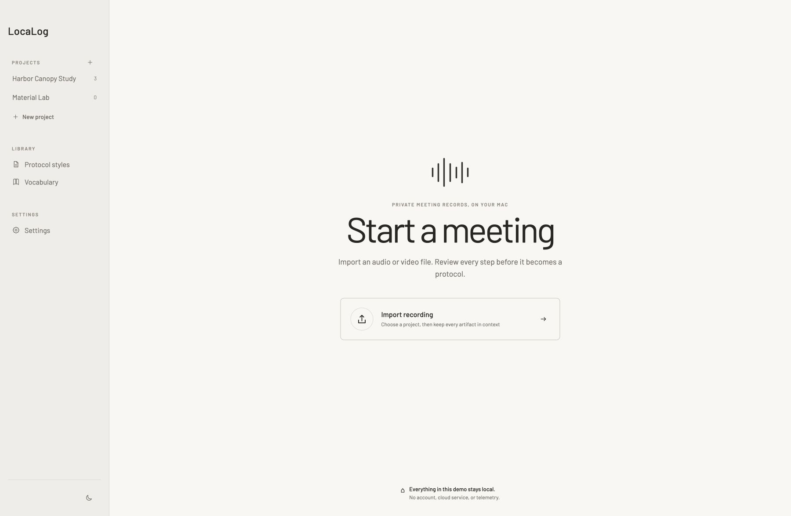

# LocaLog

### Local AI that turns meeting recordings into clear, reviewable protocols.

LocaLog is an open-source, local-first desktop application being built to turn meeting audio and video into structured, editable protocols—the written minutes or record of a meeting. It transcribes the recording, gives you a focused place to correct the transcript, and then uses a local language model to create a protocol draft that you can review, refine, and export.

The protocol is the purpose of the workflow. Transcription is the essential, reviewable source for it—not a separate end product. Recordings, transcript revisions, protocol drafts, and exports remain connected to the right meeting and project, while AI output stays provisional until a person has reviewed it.

Meeting recordings often contain confidential conversations, personal information, internal decisions, client details, or material that is not permitted to leave an organisation’s controlled environment. LocaLog is privacy-focused for that practical reason: its core workflow is designed to keep this sensitive content on the user’s device instead of requiring it to be sent to a third-party AI service.

The difference is not simply that the models run locally. Privacy, human control, reliable data handling, and a calm professional interface are designed as one product rather than added around an AI pipeline afterwards.



_Current development shell using synthetic project data. The interface will continue to evolve._

## The proposition

- **The protocol is the outcome.** Transcription, correction, and local generation form one deliberate path toward useful, editable meeting minutes.
- **Private by structure.** Sensitive meeting content stays on the device through LocaLog’s core workflow; there is no required LocaLog account, cloud workspace, or third-party AI service.
- **Context before files.** Projects and meetings keep recordings, vocabulary, transcripts, protocols, and exports meaningfully connected.
- **Human review by design.** AI output is visible, editable, and provisional. LocaLog does not quietly turn generated text into an authoritative record.
- **A serious desktop tool.** The interface is designed for reading, writing, focus, failure, and recovery—not as a chatbot, model playground, or generic SaaS dashboard.
- **Open and cross-platform.** The source is licensed under GPL-3.0-or-later. macOS is the first development environment; Windows and Linux are intended platforms.

## A deliberate working sequence

LocaLog treats meeting documentation as one connected piece of work:

`Project → Meeting → Import → Transcribe → Review → Generate → Edit → Export`

A recording is never left without context. It belongs to a meeting, and that meeting belongs to a project. The transcript can be corrected before it becomes the basis of a protocol. Generated text remains an editable draft until a person has reviewed it.

This structure matters as much as the underlying transcription and language models. The aim is not simply to produce a transcript or run local AI, but to help someone create a useful protocol through a professional workflow that feels immediate, legible, and trustworthy.

## What guides the project

- **Local by default.** Recordings, transcripts, vocabulary, drafts, and exports remain on the device through LocaLog’s core workflow.
- **Human review is part of the process.** Generated text is a starting point, never an automatic final record.
- **Projects provide context.** Meetings and their documents stay connected instead of becoming a loose collection of files.
- **The interface is part of the product.** Typography, spacing, navigation, writing, failure states, and recovery deserve the same care as storage and inference.
- **Technical detail stays in its place.** Professional choices are visible; model and runtime internals remain secondary.
- **The architecture is cross-platform.** Development and validation begin on macOS, while Windows and Linux remain intended application platforms.

LocaLog is not planned as a meeting bot, generic chatbot, cloud workspace, or model-management dashboard. Built-in microphone and system-audio recording may come later; the first complete workflow begins with imported audio or video.

## Current state

LocaLog is in early development. It is **not ready for production use or public presentation as a finished application**.

The repository currently contains:

- a working Tauri, Rust, Svelte, and TypeScript desktop foundation;
- the real navigation, visual language, light and dark themes, and primary workflow screens;
- a synthetic end-to-end demonstration with import, progress, cancellation, failure, retry, transcript review, protocol editing, and export states;
- the first production SQLite repository for projects, meetings, and pending source assignment, connected to the native shell;
- completed architecture studies for durable storage, process supervision, media normalisation and transcription, local protocol generation, and Markdown autosave.

The native shell now preserves created projects, meetings, assigned source names, and meeting-title changes across restarts. The selected media file is not copied yet, and processing jobs, transcripts, protocols, and exports still use synthetic in-memory behaviour. The real transcription-to-protocol pipeline has not been integrated, and there are no release builds yet.

The next milestone is to make the import job and original-source commit durable, then carry the fake transcription and generation results through the accepted immutable revision boundary. Real local-processing adapters will enter one at a time only after that recovery path is coherent.

## How the application is being built

The technical structure is intentionally modest:

- **Svelte and TypeScript** form the interface and its interaction model.
- **Tauri** provides the native desktop shell.
- **Rust** owns application rules, storage, background jobs, files, and local runtime integration.
- **SQLite and versioned files** preserve relationships, progress, and committed document revisions.
- **Supervised local tools** perform media and model work outside the interface thread, so navigation and writing can remain responsive.

The application core does not depend on macOS-specific concepts. Operating-system differences—such as file locations, process control, permissions, audio capture, acceleration, signing, and packaging—belong behind focused platform adapters. macOS is the first test and packaging environment; Windows and Linux are part of the intended architecture and roadmap.

The project does not silently download models or runtimes. Ollama and an installed Whisper environment have been used to validate boundaries, but neither is yet the final public distribution model.

## Read the documentation

The documentation is organised from purpose to implementation. [Start with the documentation guide](docs/README.md) if you are new to the project or do not work primarily in software.

- [Product definition](docs/PRODUCT.md) — the problem, promise, audience, scope, and principles
- [Experience and interaction](docs/UX.md) — how the application should behave and feel
- [Visual direction](docs/VISUAL_DIRECTION.md) — typography, hierarchy, restraint, and interface character
- [v0.1 scope](docs/MVP.md) — what the first useful version must prove
- [Technical architecture](docs/ARCHITECTURE.md) — how data, background work, and local runtimes fit together
- [Decisions](docs/DECISIONS.md) — what has been accepted, what remains open, and why
- [Roadmap](docs/ROADMAP.md) — later possibilities that are not promises

The folders under `spikes/` contain isolated technical evidence. They are test oracles and learning records, not production modules.

## Run the current shell

The current build is useful for design and workflow development only. It uses synthetic fixture data.

Prerequisites:

- Node.js 22.12 or newer
- npm
- Rust 1.97.1 through rustup

```sh
npm install
npm run dev
```

Use `npm run tauri dev` to run the native desktop shell. Development and verification commands are documented in [CONTRIBUTING.md](CONTRIBUTING.md).

## Contributing

LocaLog is public early so that its product reasoning, design work, and architecture can be followed in the open. The foundations are still moving, so substantial implementation proposals should begin with the relevant product or architecture discussion.

Never use real meeting recordings, transcripts, names, client information, or confidential project material in issues, fixtures, screenshots, or pull requests.

## Licence

LocaLog is free software licensed under the [GNU General Public License v3.0 or later](LICENSE). You may use, study, modify, and redistribute it under those terms, including commercially. Distributors of the application or modified versions must preserve the same freedoms and provide the corresponding source as required by the licence.

Third-party dependencies and bundled assets remain under their respective licences. Future runtime binaries and model files require separate review before they can be distributed with the application.

Copyright © 2026 Pascal Nünninghoff.
